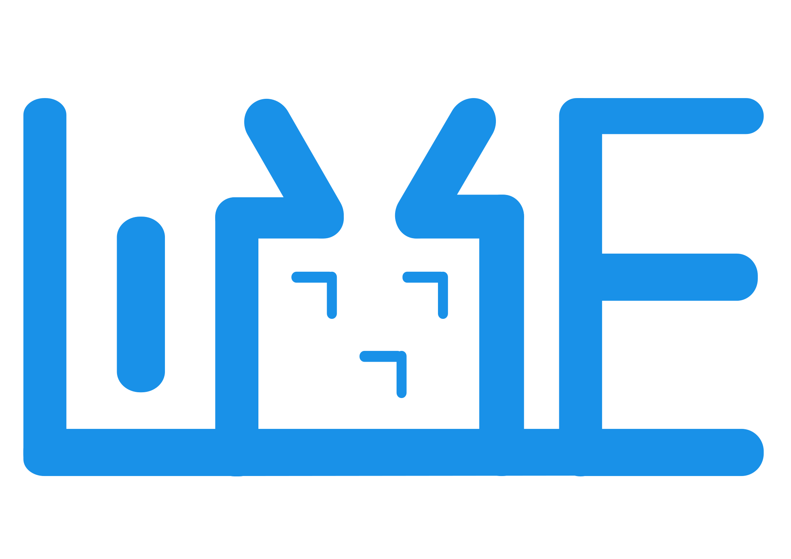

<h1 align="center">
  
   Live777 
</h1>

  <a href="https://live777.pages.dev/guide/what-is-live777">                                                                                                                                    
    <b>Documentation</b>                                                                                                                                                                        
  </a>                                                                                                                                                                                          
  |                                                                                                                                                                                             
  <a href="https://live777.pages.dev/zh/guide/what-is-live777">                                                                                                                                 
    <b>中文文档</b>                                                                                                                                                                             
  </a>   
    
   
   

    

    
    &nbsp;
    
    &nbsp;
    

---

This work is completed by Xidian University.

Live777 is an SFU server for real-time video streaming for the `WHIP`/`WHEP` as first protocol.

Live777 media server is used with [Gstreamer](https://gstreamer.freedesktop.org/), [FFmpeg](https://ffmpeg.org/), [OBS Studio](https://obsproject.com/), [VLC](https://www.videolan.org/), [WebRTC](https://webrtc.org/) and other clients to provide the ability to receive and distribute streams, and is a typical publishing (pushing) and subscription (playing) server model.

Live777 supports the conversion of audio and video protocols widely used in the Internet, such as RTP to WHIP or WHEP and other protocols.

## Features

Live777 has the following characteristics:

- 📚 **Support `WHIP`/`WHEP`**

  The WHIP/WHEP protocol is implemented to improve interoperability with other WebRTC application modules without the need for custom adaptations.

- 🗃️ **P2P/SFU Mix architecture**

  Only responsible for forwarding, do not do confluence, transcoding and other resource overhead of the media processing work, the encoding and decoding work are respectively placed on the sender and the receiver.

- 🌐 **Multiple platform support**

  Linux, MacOS, Windows, Android and arm, x86 with multi-platform native support.

### DataChannel Forward

> NOTE: About `createDataChannel()`
> 1. Live777 Don't support `label`, `createDataChannel(label)` this `label` is not used
> 2. Live777 Don't support `negotiated`, `{ id: 42, negotiated: true }` this don't support

## Sponsors

  
   
  
   
  

