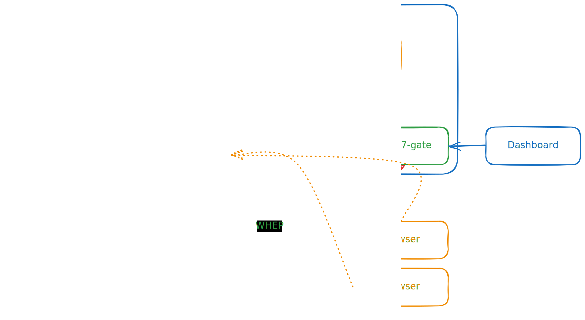

# What is Live777

A very simple, high performance, edge WebRTC SFU

## Introduction

### Cluster

## Current support encode
| protocol | video codecs                | audio codecs   |
| -------- | --------------------------- | -------------- |
| `WHIP`   | `AV1`, `VP9`, `VP8`, `H264` | `Opus`, `G722` |
| `WHEP`   | `AV1`, `VP9`, `VP8`, `H264` | `Opus`, `G722` |

## Components

### Live777 Core (liveion)

A Pure Single SFU Server for WebRTC.

Only `WHIP` / `WHEP` protocol supported.

a core SFU server, If you need a single server, use this

### Live777 Manager (liveman)

Live777 Cluster manager.

If I have so many servers (live777 core cluster), I need this manage them all.

### whipinto and whepfrom

Stream protocol convert tool.

- `RTP` => `WHIP`
- `WHEP` => `RTP`
- TODO: `RTSP` => `WHIP`
- TODO: `WHEP` => `RTSP`

### Web WHIP/WHEP client

**Open your browser, enter the URL: http://localhost:7777/**

### Debugger

example: http://localhost:7777/tools/debugger.html

You can use this test WebRTC-SVC

### Single Page Player

example: http://localhost:7777/tools/player.html?id=web-0&autoplay&controls&muted&reconnect=3000

URL params:

- `id`: string, live777 Stream ID
- `autoplay`: boolean
- `controls`: boolean
- `muted`: boolean, whether to mute by default
- `reconnect`: number, reconnect timeout in millisecond

